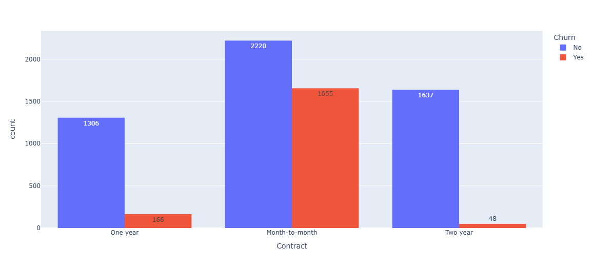
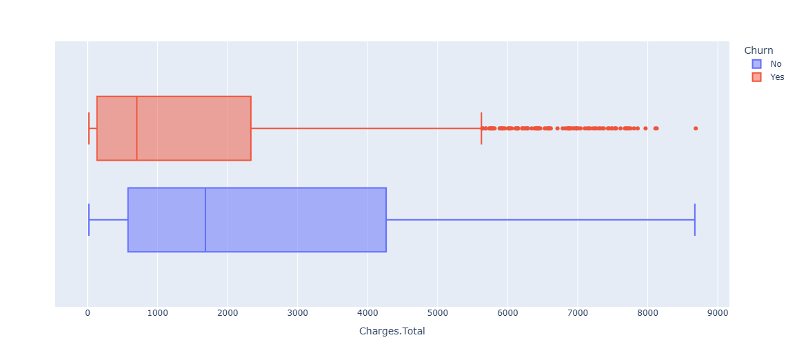

# 
TelecomX - Parte 2

## Índice
- [1. Instalación](#1-Instalación)
- [2.Propósito](#2-Propósito)
- [3.Estructura del proyecto](#3-Estructura-del-proyecto)
- [4.Descripción del proceso de preparación de los datos](#4-Descripción-del-proceso-de-preparación-de-los-datos)
- [5.Análisis exploratorio de datos)](#5-Análisis-exploratorio-de-datos)
- [6.Conclusiones)](#6-Conclusiones) 
----------------------------               

## 1. Instalación
  Se usaron las siguiente librerias:
- Pandas (para carga de datos por medio de read_csv
- Sklearn para transformación de variables categóricas (eliminando una si ya es binaria)
- Imblearn para balancear conjuntos de datos

## 2. Propósito
Predecir el churn (cancelación) de clientes en base a variables relevantes.

## 3. Estructura del proyecto

Se cuenta con 2 archivos y 1 carpeta (con 4 archivos, siendo gráficas)
- Google Colab: [Link](https://github.com/PedroB6/TelecomX-Challenge2/blob/main/TelecomX_Parte2_LATAM_AluraOracle_PedroBaca.ipynb)
- Readme: [Link](https://github.com/PedroB6/TelecomX-Challenge2/blob/main/README.md)
- Imagenes: [Link](https://github.com/PedroB6/TelecomX-Challenge2/tree/main/img) 

## 4. Descripción del proceso de preparación de los datos
En primer lugar se eiminó la variable del ID cliente, porque no era relevante para el proceso.
- Clasificación de las variables en categóricas y numéricas: Las categóricas se transformaron (texto a número, según valor) para poder entrenarse y probarse como modelo de ciencia de datos 
- Etapas de normalización o codificación: Se normalizó, para no dar mayor importancia a variables con altos números, de 0 a 1, es una escala estandar.
- Separación de los datos en conjuntos de entrenamiento y prueba: 20% para prueba y 80% para entrenamiento y con 25% de validación y 75% sobre el mismo conjunto de datos.
- Justificaciones para las decisiones tomadas durante la modelización: Se probaron 3 modelos, KNN, Árbol de decisión y Random Forest

## 5. Análisis exploratorio de datos
- La relación de la duración del contrato con la cancelación de los clientes, siendo a un año, por mes o a dos años:

- La relación del monto total con la cancelación de los clientes:

## 6. Conclusiones

- El modelo con mejor desempeño es el de random forest:
  - Con una exactitud de 0.81, superando a KNN con 0.73 y Árbol de decisión 0.77.
  - Con una precisión de 0.68, superando a KNN con 0.49 y Árbol de decisión 0.57.
  - Con una sensibilidad de 0.56, superando a KNN con 0.45 e igualando al Árbol de decisión 0.56.
  - Con un f1-score de 0.61, superando a KNN con 0.47 y Árbol de decisión 0.57.
- En la evaluación de las variables Tenure, Contrato mes a mes y Cargo total son las que más contribuyen a la reducción de la impureza durante las divisiones de los árboles y las Múltiples líneas con servicio de telefonía menos aporte tiene

